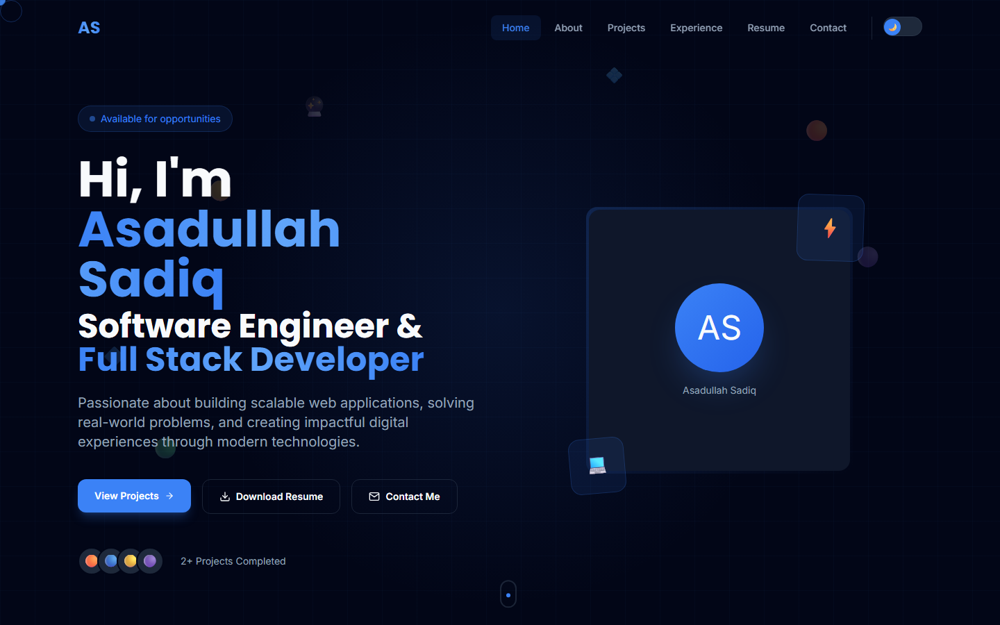
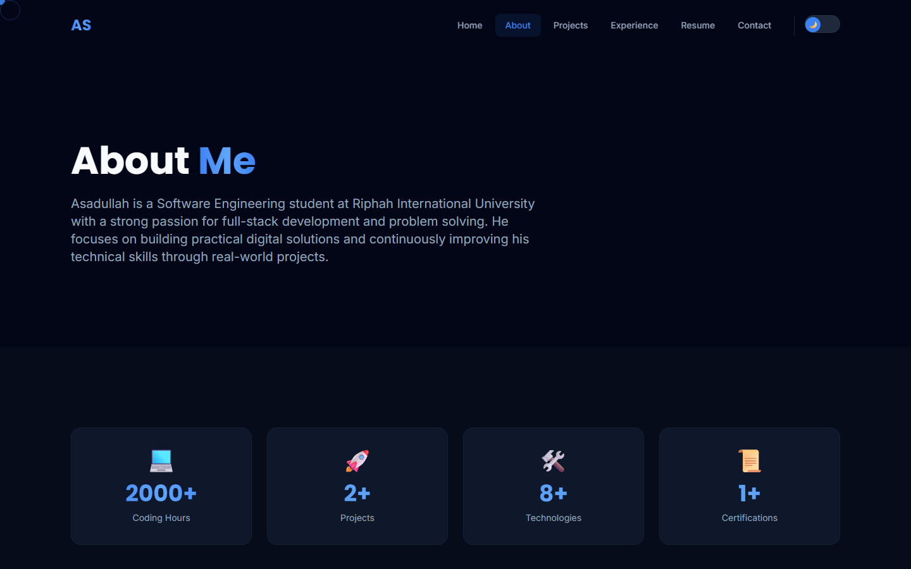
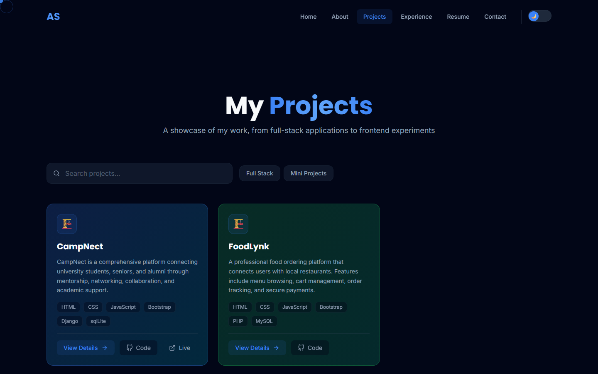
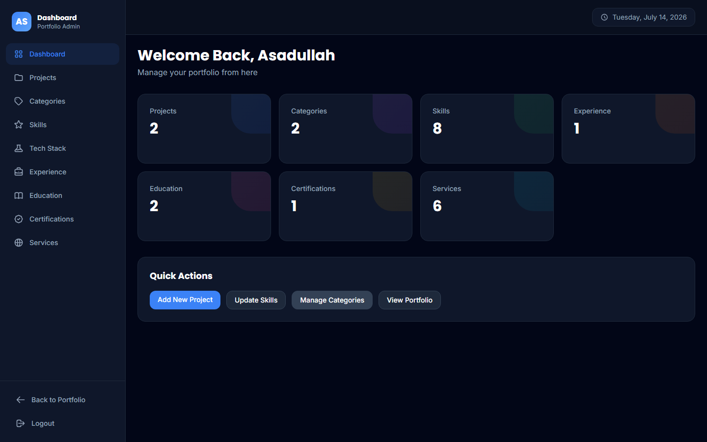
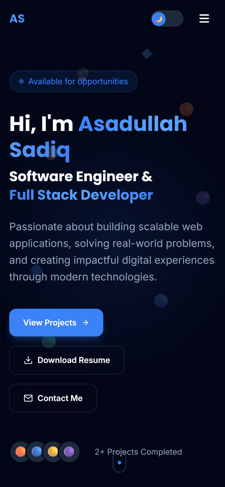

<div align="center">

# Asadullah Sadiq — Portfolio

**A modern, full-stack developer portfolio built entirely through vibe coding.**

[](https://nextjs.org)
[](https://react.dev)
[](https://tailwindcss.com)
[](https://www.framer.com/motion)
[](https://vercel.com)

[](https://asadullahsadiq.vercel.app)

### 🔗 [https://asadullahsadiq.vercel.app](https://asadullahsadiq.vercel.app)

</div>

---

## Screenshots

> **Note:** Replace the placeholder images below with your actual screenshots. Place them in a `screenshots/` folder in the repo root.

### Home Page



### About Section



### Projects Gallery



### Admin Dashboard



### Dark Mode


### Mobile Responsive



---

## Features

- **Hero Section** — Animated entrance with GSAP, floating tech icons, and live project counter
- **Tech Stack** — Interactive skill bars with category filtering
- **Featured Projects** — Filterable project gallery with search and category tabs
- **Project Details** — Dynamic individual project pages with image galleries
- **Services** — Animated service cards with hover effects
- **Experience Timeline** — Interactive career timeline with animations
- **Resume Page** — Professional resume view with download option
- **Contact Form** — Validated form with toast notifications and email integration
- **Admin Dashboard** — Full CRUD panel for managing projects, skills, experience, education, certifications, services, and categories
- **Theme Toggle** — Dark/Light mode with `localStorage` persistence
- **Custom Cursor** — Desktop-only cursor follower effect
- **Smooth Scrolling** — Lenis-powered buttery smooth scroll
- **SEO Optimized** — Dynamic sitemap, OpenGraph metadata, and `robots.txt`
- **Responsive Design** — Mobile-first layout across all breakpoints

---

## Tech Stack

| Layer | Technology |
|-------|-----------|
| Framework | [Next.js 14](https://nextjs.org) (App Router) |
| UI Library | [React 18](https://react.dev) |
| Styling | [Tailwind CSS 3](https://tailwindcss.com) |
| Animations | [Framer Motion](https://www.framer.com/motion) + [GSAP](https://gsap.com) |
| Smooth Scroll | [Lenis](https://github.com/darkroomengineering/lenis) |
| Icons | [React Icons](https://react-icons.github.io/react-icons) |
| Utilities | [clsx](https://github.com/lukeed/clsx) |
| Deployment | [Vercel](https://vercel.com) |
| Language | JavaScript (JSX) |

---

## Built With Vibe Coding

This entire project was built using **vibe coding** — a development approach where natural language prompts guide an AI to generate, iterate, and refine code in real time. Every component, animation, API route, and design decision was shaped through conversational prompting rather than traditional manual coding.

> *Vibe coding is the future of software development — where ideas flow directly into working code through the power of AI-assisted iteration.*

---

## Getting Started

### Prerequisites

- [Node.js](https://nodejs.org) 18+ installed
- npm or yarn package manager

### Installation

```bash
# Clone the repository
git clone https://github.com/your-username/portfolio.git

# Navigate to project directory
cd portfolio

# Install dependencies
npm install

# Start development server
npm run dev
```

Open [http://localhost:3000](http://localhost:3000) in your browser.

### Production Build

```bash
npm run build
npm start
```

---

## Project Structure

```
portfolio/
├── public/
│   └── robots.txt
├── src/
│   ├── app/                  # Next.js App Router pages
│   │   ├── page.js           # Home page
│   │   ├── about/            # About page
│   │   ├── projects/         # Projects listing + dynamic [id]
│   │   ├── experience/       # Experience timeline
│   │   ├── resume/           # Resume page
│   │   ├── contact/          # Contact form
│   │   ├── login/            # Admin login
│   │   ├── dashboard/        # Admin dashboard (8 CRUD sections)
│   │   ├── api/              # REST API routes (16 endpoints)
│   │   ├── layout.js         # Root layout + metadata
│   │   ├── globals.css       # Global styles + Tailwind
│   │   └── sitemap.js        # Dynamic sitemap generation
│   ├── components/           # Reusable React components
│   │   ├── HeroSection.jsx
│   │   ├── Navbar.jsx
│   │   ├── Footer.jsx
│   │   ├── ProjectCard.jsx
│   │   ├── SkillBar.jsx
│   │   ├── Timeline.jsx
│   │   ├── ContactForm.jsx
│   │   ├── ThemeToggle.jsx
│   │   ├── CustomCursor.jsx
│   │   ├── FloatingIcons.jsx
│   │   ├── AnimatedSection.jsx
│   │   └── dashboard/        # Dashboard-specific components
│   ├── data/                 # JSON data files (projects, skills, etc.)
│   └── lib/                  # Utility functions (API helpers, cn())
├── tailwind.config.js
├── next.config.js
├── postcss.config.js
└── package.json
```

---

## API Endpoints

| Method | Endpoint | Description |
|--------|----------|-------------|
| `GET` | `/api/projects` | List all projects |
| `POST` | `/api/projects` | Create a project |
| `GET` | `/api/projects/[id]` | Get project by ID |
| `PUT` | `/api/projects/[id]` | Update a project |
| `DELETE` | `/api/projects/[id]` | Delete a project |
| `GET` | `/api/skills` | List all skills |
| `POST` | `/api/skills` | Create a skill |
| `GET` | `/api/experience` | List experience |
| `POST` | `/api/experience` | Add experience |
| `GET` | `/api/education` | List education |
| `POST` | `/api/education` | Add education |
| `GET` | `/api/certifications` | List certifications |
| `POST` | `/api/certifications` | Add certification |
| `GET` | `/api/services` | List services |
| `POST` | `/api/services` | Add service |
| `GET` | `/api/techstack` | Get tech stack |
| `PUT` | `/api/techstack` | Update tech stack |
| `POST` | `/api/contact` | Send contact message |

---

## Deployment

This project is deployed on **Vercel** with zero configuration.

```bash
# Install Vercel CLI
npm install -g vercel

# Login
vercel login

# Deploy
vercel --prod
```

---

## License

**All Rights Reserved.** This project is proprietary and confidential.  
No part of this codebase may be copied, modified, distributed, or used in any form without explicit written permission from the author.

Copyright &copy; 2025 Asadullah Sadiq. All rights reserved.

---

<div align="center">

**Made with passion through vibe coding.**

[](https://github.com/asadullahsadiq)
[](https://linkedin.com/in/asadullahsadiq)
[](mailto:asadalvi979@gmail.com)

</div>
